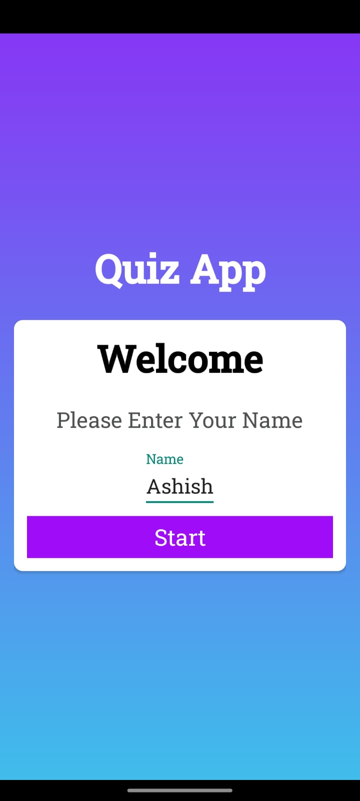
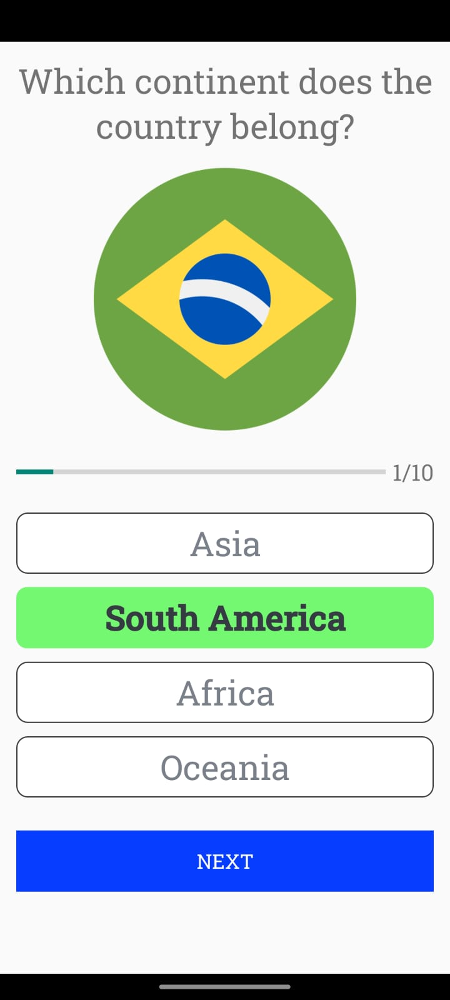
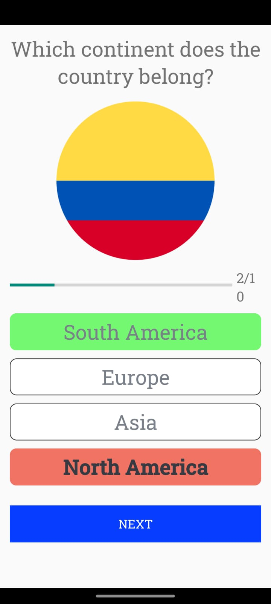
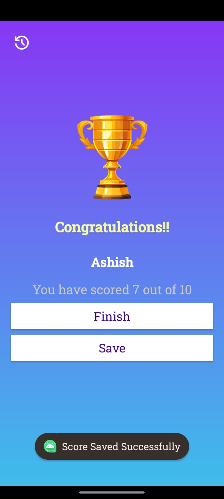
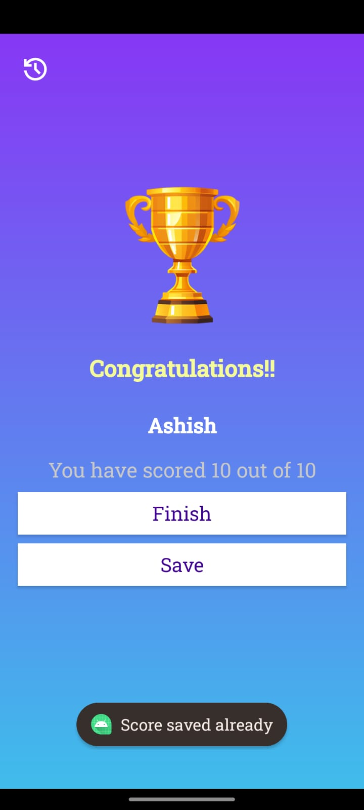
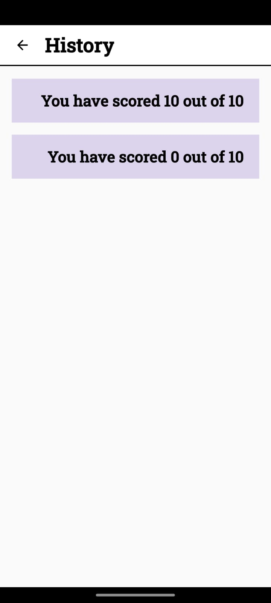

# Quiz App 🌍📱

<div align="center">


A simple Android Quiz App based on country flags and their corresponding continents.

</div>

---

## 📖 Description

This application presents users with multiple quiz questions based on country flags and the continent to which they belong.

Each question contains:
- A country flag image
- Four answer options
- A button to verify the selected answer

### ✅ Quiz Logic
- If the selected answer is correct:
  - The selected option turns **Green**
- If the selected answer is incorrect:
  - The selected option turns **Red**
  - The correct option is automatically highlighted in **Green**

At the end of the quiz, the user receives a scorecard displaying:
- Total correct answers
- Total number of questions

---

# 📸 Screenshots

## Home Screen
<p align="center">

</p>

---

## Quiz Screen
<p align="center">
  
  
</p>

---

## Result Screen
<p align="center">
  
  
</p>

---
## History Screen
<p align="center">
  
</p>

---

# 🛠️ Tools & Technologies Used

- Kotlin
- Android Studio
- XML
- Android SDK
- Intents
- TextView
- ImageView
- ProgressBar
- LinearLayout
- Drawable Resources
- Git & GitHub

---

# 📂 Project Structure

```text
QuizApp/
│
├── .idea/
├── ScreenShots/
│   ├── home.png
│   ├── quiz_screen.png
│   └── result_screen.png
│
├── app/
│   └── src/
│       ├── androidTest/
│       │   └── java/com/example/quizapp
│       │
│       ├── test/
│       │   └── java/com/example/quizapp
│       │
│       └── main/
│           ├── java/com/example/quizapp/
│           │   ├── model/
│           │   ├── supporting/
│           │   ├── ui/theme/
│           │   ├── utils/
│           │   └── MainActivity.kt
│           │
│           ├── res/
│           │   ├── drawable/
│           │   ├── layout/
│           │   ├── mipmap/
│           │   └── values/
│           │
│           └── AndroidManifest.xml
│
├── gradle/
├── .gitignore
├── build.gradle.kts
├── gradle.properties
├── gradlew
├── gradlew.bat
└── settings.gradle.kts
```

---

# 🚀 Features

- Multiple quiz questions
- Country flag based quiz
- Four selectable options
- Correct/Wrong answer indication
- Automatic correct answer highlighting
- Progress bar
- Result screen with score
- Save option is there to save your progress
- Local database is added to save the progress
- Interactive UI

---

# 🧠 Concepts Practiced / Experience Gained

Through this project, I practiced and learned:

- Android Activity Navigation using Intent
- XML Layout Designing
- Click Listeners
- Dynamic UI Updates
- Kotlin Basics
- Drawable and Resource Management
- ProgressBar Handling
- Conditional Logic
- Working with Lists and Custom Data Models
- GitHub Project Uploading
- Android Project Structure Understanding

---

# 🔮 Future Improvements

Possible future enhancements for the project:

- Timer based quiz
- Sound effects
- Animations and transitions
- Dark mode support
- Randomized questions
- Difficulty levels
- Online multiplayer mode
- More countries and categories

---

# ⚙️ How to Clone & Run

## Clone the repository

```bash
git clone https://github.com/ashish-modak-22/Android_Simple_Quiz_App.git
```

---

## Open in Android Studio

1. Open Android Studio
2. Click on **Open**
3. Select the cloned project folder
4. Let Gradle sync complete
5. Run the application on Emulator or Physical Device

---

# 👨‍💻 Author

Ashish Modak

---
